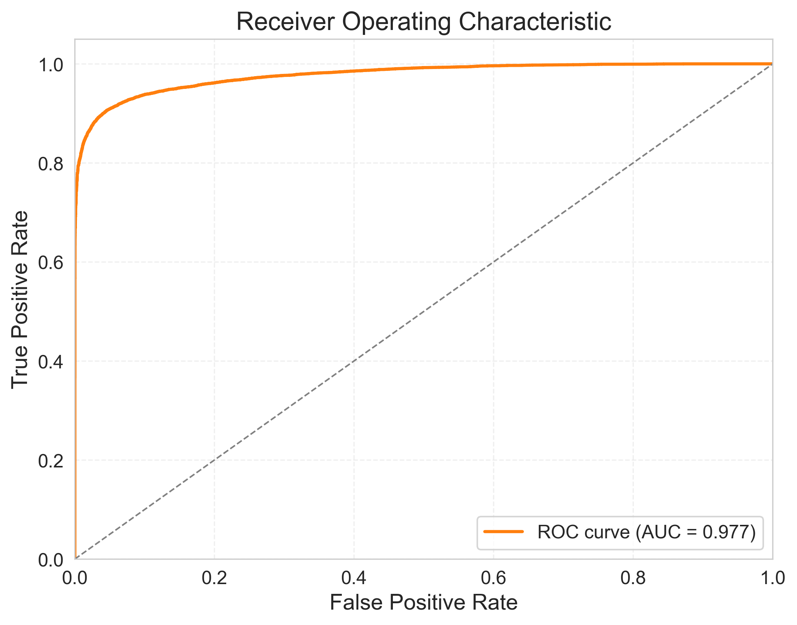
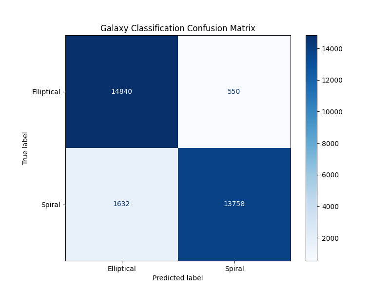
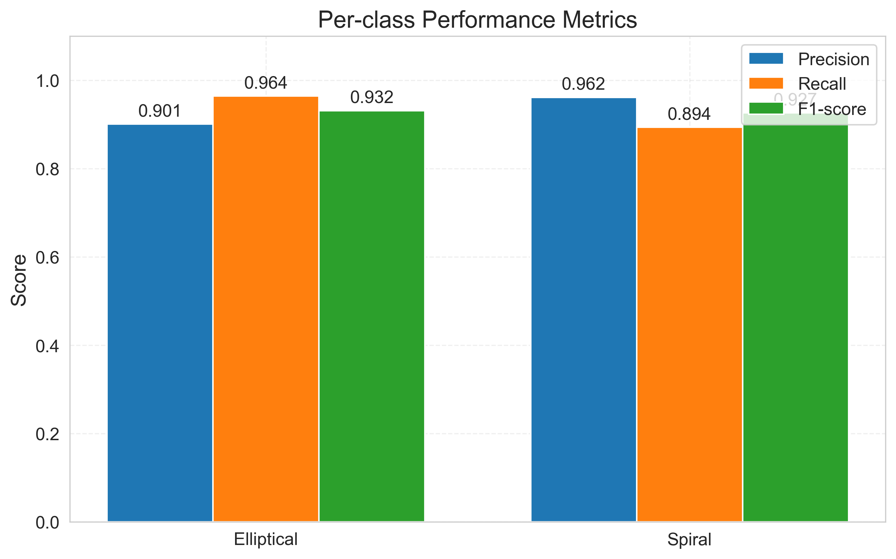
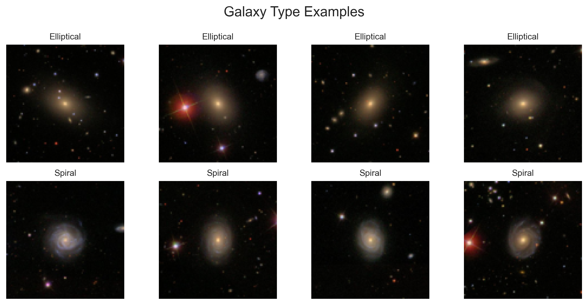
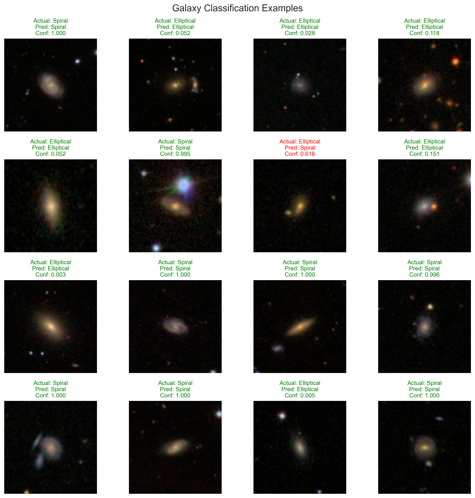
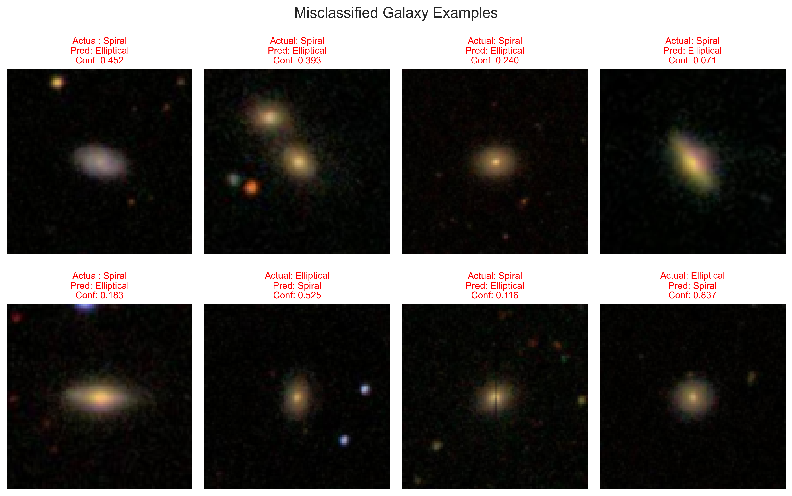

## Motivation (Physics-Oriented)

Galaxy morphology encodes key information about galaxy formation and evolutionary history.  
Automating morphological classification is essential for modern and upcoming large sky surveys, where manual labeling is infeasible due to data volume.

---

## Dataset

- **Source:** Galaxy Zoo 2  
- **Classes:** Spiral vs Elliptical  
- **Class imbalance handling:** SMOTE  
- **Preprocessing:**  
  - Image normalization  
  - Resizing  
  - Data augmentation  

---

## Methodology

- **Framework:** TensorFlow / Keras  
- **Architecture:** Custom Convolutional Neural Network  
- **Loss function:** Categorical Cross-Entropy  
- **Optimizer:** Adam  
- **Imbalance handling:** SMOTE applied in feature space  

---

## Results

### Dataset Balance

The final dataset was explicitly balanced between the two morphology classes to avoid bias in evaluation.

- **Elliptical:** 102,599 galaxies (50.0%)  
- **Spiral:** 102,599 galaxies (50.0%)

This ensures that reported metrics reflect true model performance rather than class imbalance effects.

---

### Overall Classification Performance

The convolutional neural network demonstrates strong discriminative capability between elliptical and spiral galaxies.

- **ROC–AUC:** 0.977  
- **Average Precision (PR–AUC):** 0.981  

The ROC curve shows a high true positive rate at low false positive rates, while the precision–recall curve remains close to unity over most recall values, indicating robust performance across decision thresholds.

---

### Confusion Matrix

Performance on the held-out test set is summarized below:

**Elliptical galaxies**
- Correctly classified: 14,840  
- Misclassified as Spiral: 550  

**Spiral galaxies**
- Correctly classified: 13,758  
- Misclassified as Elliptical: 1,632  

The primary source of error arises from spiral galaxies with weak or poorly resolved arm structures, which are occasionally classified as ellipticals. This behavior is consistent with known morphological ambiguities, particularly for low signal-to-noise or edge-on systems.

---

### Per-Class Metrics

| Class        | Precision | Recall | F1-score |
|-------------|----------|--------|---------|
| Elliptical  | 0.901    | 0.964  | 0.932   |
| Spiral      | 0.962    | 0.894  | 0.927   |

Elliptical galaxies exhibit higher recall, while spiral galaxies show higher precision. This indicates that the model is conservative when assigning the spiral class, favoring precision over recall.

---

### Probability Calibration

The calibration curve closely follows the ideal diagonal, demonstrating that the predicted probabilities are well calibrated.  
This implies that the model’s confidence scores can be meaningfully interpreted as approximate posterior probabilities, which is important for downstream astronomical analyses and catalog construction.

---

### Qualitative Predictions

Correctly classified examples show that the network reliably identifies:

- Smooth light distributions and central concentration for elliptical galaxies  
- Disk-like structures and spiral arm features for spiral galaxies  

Misclassified examples typically involve:

- Low surface-brightness spiral arms  
- Edge-on spiral galaxies resembling smooth ellipticals  
- Foreground star contamination or nearby companions  

In many failure cases, the predicted confidence is low, indicating intrinsic ambiguity rather than overconfident misclassification.

---

### Training Dynamics

Training and validation accuracy increase smoothly over epochs, while both training and validation loss decrease without divergence.  
The small gap between training and validation curves indicates minimal overfitting and stable generalization.

---

## Summary

The model achieves:

- High discriminative performance (ROC–AUC ≈ 0.98)  
- Balanced per-class metrics  
- Physically interpretable failure modes  
- Well-calibrated probabilistic outputs  

Overall, the CNN appears to learn meaningful morphological features rather than dataset-specific artifacts.

---

## Limitations

- Binary classification only  
- SMOTE may introduce non-physical synthetic samples  
- Dataset size limited  

---

## Future Work

- Extension to multi-class galaxy morphology  
- Transfer learning using architectures such as ResNet or EfficientNet  
- Uncertainty estimation and probabilistic classification  

---

## Author

**Aryan Bandyopadhyay**  
Integrated MSc Physics  
School of Physical Sciences  
NISER Bhubaneswar
